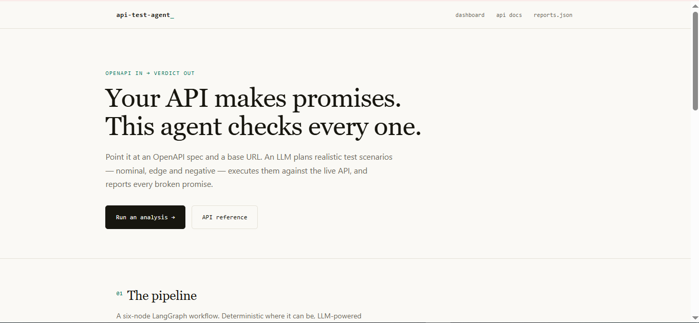
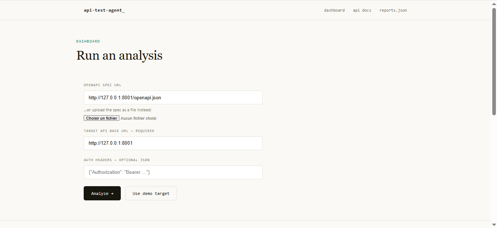
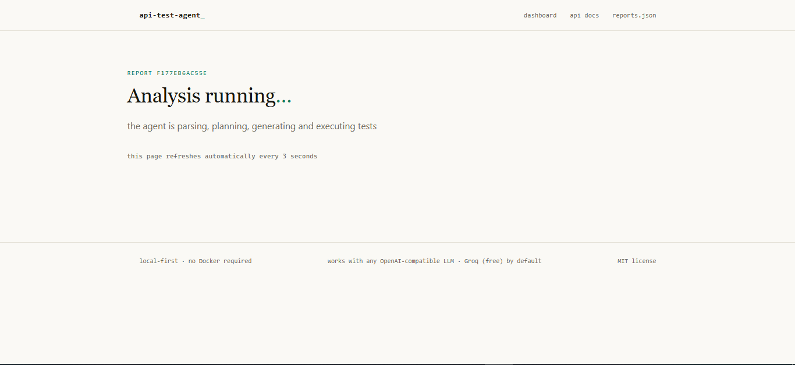
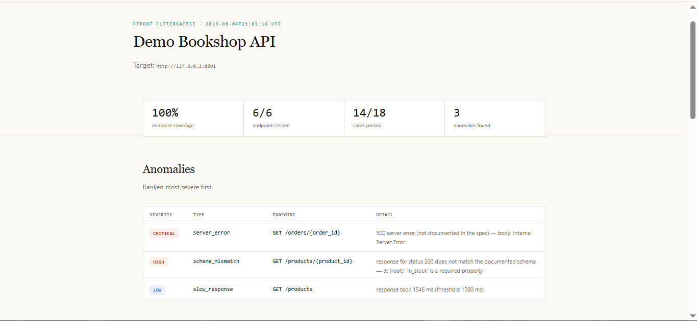
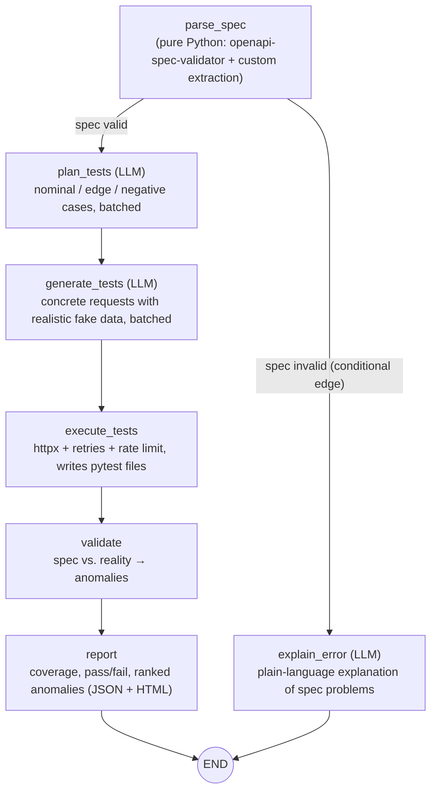

# API Test Agent

An AI agent that reads an **OpenAPI 3.x spec**, generates realistic test scenarios with an LLM, executes them against your running API, and produces a **coverage & anomaly report** — plus a re-runnable **pytest** suite.

Built with **LangGraph**, **FastAPI**, **httpx**, and **pytest**. Works with any OpenAI-compatible provider — **Groq (free) by default**.

## Screenshots

|  |  |
|---|---|
| **Landing**<br/> | **Dashboard — run an analysis**<br/> |
| **Analysis running (auto-refresh)**<br/> | **Report — ranked anomalies**<br/> |

## What it finds

- **Undocumented status codes** — the API returns codes the spec never mentions
- **Schema mismatches** — response bodies that violate the declared response schemas
- **5xx server errors** — including ones the spec doesn't document (ranked *critical*)
- **Suspiciously slow endpoints** — latency above a configurable threshold
- **Endpoint coverage** — how much of the spec was actually exercised

## The LangGraph workflow



All nodes share one typed Pydantic state ([app/models/state.py](app/models/state.py)). The LLM nodes process endpoints in **batches** (map pattern) to keep prompts compact for free-tier token limits.

## Quickstart in 3 commands (no Docker)

Requires Python 3.11–3.13 (the pinned dependencies don't ship 3.14 wheels yet). First, copy `.env.example` to `.env` and set `GROQ_API_KEY` (free key at [console.groq.com](https://console.groq.com)).

```bash
pip install -r requirements.txt
uvicorn app.demo_api.main:app --port 8001   # terminal 1: demo API (with planted bugs)
uvicorn app.api.main:app --port 8000        # terminal 2: the agent
```

Then start an analysis against the demo API:

```bash
curl -X POST http://127.0.0.1:8000/analyze \
  -F "spec_url=http://127.0.0.1:8001/openapi.json" \
  -F "target_url=http://127.0.0.1:8001"
```

The response contains a `report_id`. Watch the results at:

- `http://127.0.0.1:8000/reports/<report_id>/html` — readable report (auto-refreshes while running)
- `http://127.0.0.1:8000/reports/<report_id>` — raw JSON

You can also upload a spec file instead of a URL:

```bash
curl -X POST http://127.0.0.1:8000/analyze \
  -F "spec_file=@examples/petstore.yaml" \
  -F "target_url=https://petstore.example.com"
```

Authenticated APIs: pass extra headers as JSON — `-F 'auth_headers={"Authorization": "Bearer <token>"}'`.

### What the demo finds

The demo Bookshop API ([app/demo_api/main.py](app/demo_api/main.py)) ships with three intentional bugs the agent should flag:

| Bug | Endpoint | Detected as |
|---|---|---|
| Unknown order id raises instead of 404 | `GET /orders/{order_id}` | `server_error` (critical, undocumented 500) |
| `price` returned as string, `in_stock` missing | `GET /products/{product_id}` | `schema_mismatch` (high) |
| Artificial 1.5 s delay | `GET /products` | `slow_response` |

## Re-running the generated tests

Every run writes a standalone pytest suite to `generated_tests/<report_id>/`:

```bash
pytest generated_tests/<report_id>
# point the same suite at another deployment:
TARGET_BASE_URL=https://staging.example.com pytest generated_tests/<report_id>
```

## API

| Method | Path | Description |
|---|---|---|
| GET | `/` | Product landing page |
| GET | `/dashboard` | Launch analyses from a form, browse past runs |
| POST | `/analyze` | Start a run. Form fields: `target_url` (required), `spec_url` or `spec_file`, optional `auth_headers` (JSON object). Returns `202` + `report_id`. |
| GET | `/reports` | List past runs |
| GET | `/reports/{id}` | Report as JSON (report is `null` while running) |
| GET | `/reports/{id}/html` | Readable HTML report |
| GET | `/health` | Liveness probe |

Reports are persisted in SQLite (`reports.db`).

## Configuration

All settings come from environment variables / `.env` (see [.env.example](.env.example)):

| Variable | Default | Purpose |
|---|---|---|
| `GROQ_API_KEY` | — | **Required.** Free at [console.groq.com](https://console.groq.com) |
| `LLM_MODEL` | `llama-3.3-70b-versatile` | Model served by Groq |
| `AGENT_BATCH_SIZE` | `4` | Endpoints per LLM call |
| `AGENT_MAX_ENDPOINTS` | `30` | Cap on endpoints analyzed per run |
| `AGENT_RATE_LIMIT_RPS` | `5` | Max requests/second against the target |
| `AGENT_REQUEST_TIMEOUT` | `15` | HTTP timeout (s) for target calls |
| `AGENT_SLOW_THRESHOLD_MS` | `1000` | Latency anomaly threshold |
| `REPORTS_DB` | `reports.db` | SQLite path |
| `GENERATED_TESTS_DIR` | `generated_tests` | Where pytest suites are written |

**Switching LLM providers:** everything goes through [app/llm.py](app/llm.py) — swap `ChatGroq` for any LangChain chat model (OpenAI, Anthropic, Ollama, …) and nothing else changes. Rate limits (429) are retried with exponential backoff; structured output falls back to raw-JSON parsing when tool-calling fails.

## Project structure

```
app/
├── graph/workflow.py     # StateGraph assembly + conditional edge
├── nodes/                # one module per workflow node
│   ├── spec_parser.py    #   pure-Python OpenAPI parsing & validation
│   ├── test_planner.py   #   LLM: what to test (nominal/edge/negative)
│   ├── test_generator.py #   LLM: concrete requests with realistic data
│   ├── executor.py       #   httpx execution + pytest file export
│   ├── validator.py      #   spec-vs-reality anomaly detection
│   ├── reporter.py       #   final report assembly
│   ├── error_explainer.py#   reached when the spec is invalid
│   └── prompting.py      #   compact schema summaries for prompts
├── models/               # typed state, spec, plan, cases, report
├── llm.py                # single LLM entry point (Groq default)
├── config.py             # env-based settings
├── api/                  # agent FastAPI app + SQLite storage + HTML report
└── demo_api/             # demo target API with intentional bugs
examples/petstore.yaml    # sample spec
tests/                    # unit tests (parser + validator), no LLM/network needed
```

## Running the project's own tests

```bash
pytest
```

The unit tests cover the spec-parsing node and the validation/anomaly logic; they need no API key and no network.

## Docker (optional alternative)

The primary workflow is local (`pip` + `uvicorn`, above). If you prefer containers:

```bash
docker compose up --build
```

This starts the demo API on `:8001` and the agent on `:8000` (reads `GROQ_API_KEY` from your `.env`).

## License

MIT
"# api-test-agent" 
